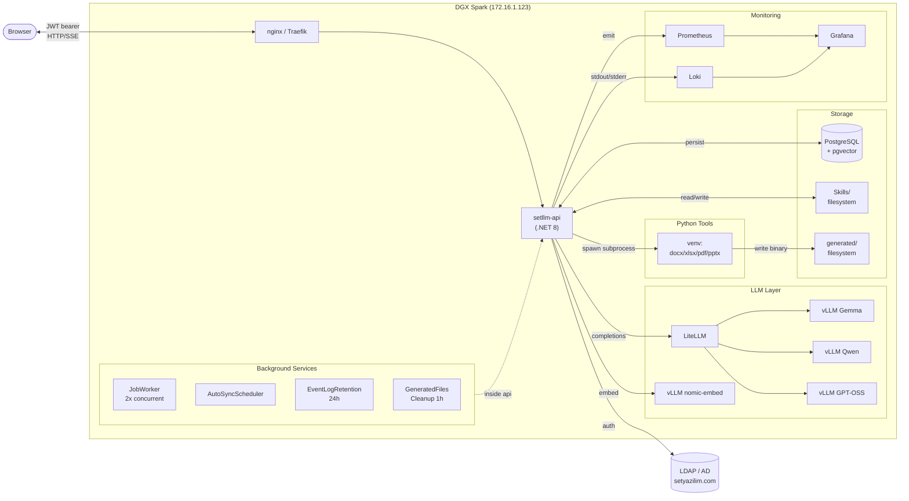

# ARCHITECTURE.md

> SET LLM platformunun bileşenleri, veri akışı ve mimari kararları.

## İçindekiler
- [Bileşen Diyagramı](#bileşen-diyagramı)
- [Veri Akışı](#veri-akışı)
- [Bileşenler](#bileşenler)
- [Database Şeması](#database-şeması)
- [Deploy Pipeline](#deploy-pipeline)
- [Frontend Mimarisi](#frontend-mimarisi)
- [Skills Mimarisi](#skills-mimarisi)
- [Audit Logging](#audit-logging)
- [Frontend Auth Flow](#frontend-auth-flow)

## Bileşen Diyagramı



## Veri Akışı

### Chat completion
1. Browser → POST `/api/llm/completions` (JWT)
2. .NET → LiteLLM → vLLM → token stream
3. .NET → SSE → browser

### RAG sorgu
1. Browser → POST `/api/llm/completions` (mode=rag)
2. .NET → embed → pgvector hibrit arama → top-N chunk
3. .NET → context'i system prompt'a ekle → LLM call
4. SSE → browser

### SQL Data Sync
1. Admin → "🔄 Sync" → POST `/api/admin/sql-connections/{id}/sync-data`
2. JobService → "sql.sync-data" kuyruğa atar
3. JobWorker → SqlSyncDataJobHandler → tablo başına delta query → row hash → değişen satırlar RAG'a ingest
4. Progress: `/api/jobs/{id}` polling

## Bileşenler

### Frontend (React + Vite + TypeScript)
- **Build**: `npm run build` → `dotnet/Api/wwwroot/` (statik dosya olarak .NET sunar)
- **State**: Zustand + `persist` (localStorage'a sohbet geçmişi)
- **UI library**: Tailwind CSS + özel theme.css
- **Streaming**: native fetch + EventSource (SSE) — token by token
- **Tool calling**: BUILTIN_TOOLS (`get_datetime`, `calculate`, `http_get`, `http_post`, `generate_file`)

### Backend (.NET 8 Minimal API)
- **Auth**: JWT bearer; LDAP doğrulama Novell.Directory.Ldap.NETStandard (ARM64 uyumlu)
- **Database**: Npgsql + raw SQL (Dapper / EF Core kullanılmıyor — hız + kontrol için)
- **DI**: Hosted services job worker + zamanlanmış görevler için
- **Tool dispatch**: HTTP proxy + Python subprocess (generate_file)
- **Event log**: Scoped IEventLog, otomatik context yakalama (IP, UA, request_id)

### LLM Layer
- **vLLM** — 3 model co-resident (Gemma 4 26B FP4, Qwen3 27B, GPT-OSS 120B MXFP4)
- **LiteLLM** — model routing, virtual keys, cost tracking, retry/fallback
- **nomic-embed-text-v1.5** — 768d embeddings (ayrı vLLM instance, port 8004)

### Storage
- **PostgreSQL 16 + pgvector** — RAG vektörleri, audit log, jobs queue, settings, ratings
- **Skills/** — `dotnet/Api/Skills/` (repodaki dosyalar + Anthropic skill folder'ları)
- **generated/** — geçici üretilmiş dosyalar (`/home/admin/setllm-api/generated/{user}/{token}/`)

### Background Services
- `JobWorker` — `SKIP LOCKED` ile concurrent çalışır (2x default)
- `AutoSyncScheduler` — SQL connection auto_sync_interval_min'e göre tetikler
- `EventLogRetentionService` — 90 gün eski event_log satırlarını siler
- `GeneratedFilesCleanupService` — 24h TTL ile üretilmiş dosyaları siler
- `SkillRegistryEagerInitializer` — Startup'ta skill'leri yükle (lazy değil)

### Monitoring
- **Prometheus** — `/metrics` scrape (setllm + vLLM + Traefik + cAdvisor + DCGM)
- **Grafana** — 2 dashboard: DGX Spark — LLM Stack, DGX Spark — LLM Concurrent & Benchmark
- **Loki + Promtail** — log aggregation (Docker socket scraping)

## Database Şeması

Ana tablolar:
- `documents` — RAG vektörlü dökümanlar
- `sql_connections` — SQL veri kaynakları (şifreli)
- `sql_table_configs` — tablo bazlı sync ayarları (PK, updated_col, grup, kolon seçimi)
- `sql_ingested_objects` — şema objeleri (hash-tracked)
- `sql_ingested_rows` — satır bazlı ingest tracking
- `sql_table_groups` — gruplandırma
- `jobs` — background job queue
- `activity_log` — eski denetim kaydı (read-only deprecated, Faz 2 sonrası)
- `event_log` — OWASP uyumlu yeni denetim kaydı
- `prompt_templates` — slash-command şablonları
- `skill_examples` — few-shot örnekler (skill başına)
- `skill_settings` — skill order overrides (UI ile yönetilir, deploy-survived)
- `message_ratings` — 👍/👎 geri bildirim
- `benchmark_results` — benchmark history
- `usage_logs` — token kullanım/maliyet

Tüm tablolar startup'ta `CREATE TABLE IF NOT EXISTS` ile garantili.

### İlişkiler (text-ER)
```
sql_connections (1) ──< sql_ingested_objects   (şema ingest tracking)
sql_connections (1) ──< sql_table_configs      ──< sql_ingested_rows
sql_connections (1) ──< sql_table_groups       ──┘ (table-config groupId)

documents (1) ─── (chunks pgvector embedding)
prompt_templates (standalone)

skill_settings.skill_id → Skills/ filesystem'deki skill id

jobs (standalone — no FK; params JSON içinde ConnectionId vs.)

event_log    — append-only audit (90 gün retention)
activity_log — legacy audit (LogActivity dual-write)
benchmark_results — N paralel LLM testlerinin sonuçları
usage_logs   — kullanıcı/model bazlı token + maliyet
message_ratings — 👍/👎 oylar (request_id ile)
```

### Önemli sütunlar
- `sql_connections.encrypted_password` — DataProtection ile şifrelenmiş
- `sql_connections.auto_sync_interval_min` — 0 (kapalı) veya 15/30/60/180/360/720/1440/10080
- `sql_table_configs.included_columns` — JSON array (`[]` = tümü)
- `sql_table_configs.last_sync_status` — 'ok' / 'failed' / NULL
- `jobs.status` — 'queued' / 'running' / 'completed' / 'failed' / 'cancelled'
- `event_log.details` — JSONB (request bağlamı, hatalar, ek info)
- `event_log.category` — Auth/Authz/Session/Input/Config/Data/Security/System
- `event_log.severity` — Debug/Info/Warn/Error/Critical

## Deploy Pipeline

### Tetikleyici
`main` branch'e push → GitHub Actions `Deploy to DGX` workflow.

### Runner
**self-hosted** — DGX Spark üzerinde direkt çalışan runner. Repo `~/Documents/MultiModel/dgx-spark-llm-stack` altında klonlu.

### Adım adım
1. `git fetch origin && git reset --hard origin/main` — branch'i senkronla
2. **vLLM model name validation** — `.env`'deki `GEMMA_MODEL_NAME` vs. vLLM'in raporladığı isim eşleşmesi (uyumsuzluk uyarı)
3. **Frontend build** — `npm run build` → `dotnet/Api/wwwroot/` altına bundle
4. **Backend publish** — `dotnet publish -c Release -o /tmp/setllm-publish`
5. **Asset copy**:
   - `Skills/` klasörü (repo → publish output)
   - `scripts/file-gen.py` (publish output altına)
6. **Python venv kurulumu** — idempotent (`/home/admin/setllm-tools/venv` yoksa oluştur + paket yükle)
7. **appsettings merge** — `scripts/merge_appsettings.py`:
   - Sunucudaki mevcut config'i (`~/setllm-api/appsettings.json`) repo versiyonu ile **deep-merge** et
   - **Server wins** — production şifreler/secret'lar korunur
   - Repo'daki yeni anahtarlar eklenir (örn: yeni `Limits` bölümü)
8. **Atomic replace** — `rm -rf ~/setllm-api && mv /tmp/setllm-publish ~/setllm-api`
9. **Service restart** — `sudo systemctl restart setllm-api`
10. **Smoke** — `curl /health` → "ok" doğrulaması

### Süre
Tipik 20-25 saniye (frontend bundle dahil).

### Önemli notlar
- `~/setllm-api/` her deploy'da yeniden oluşur — **persistent veri** için sadece:
  - PostgreSQL (172.16.0.8 — başka sunucu)
  - `Skills/` (repodan deploy ediliyor; UI'dan eklenenler **commit edilmeli**)
  - `appsettings.json` server-side override değerleri (merge ile korunur)
- `generated/` klasörü deploy ile silinir — geçici dosyalar zaten 24h TTL
- `event_log` ve diğer tüm DB tabloları PostgreSQL'de, deploy etkilemez

## Frontend Mimarisi

```
frontend/src/
├── main.tsx                  # Entry — installAuthInterceptor + React mount
├── App.tsx                   # Router (login / chat / admin)
├── store/index.ts            # Zustand store (persist'li) + i18n (t())
├── api/
│   ├── admin.ts              # tüm admin endpoint client'ları
│   ├── llm.ts                # streamCompletion + BUILTIN_TOOLS
│   ├── auth-interceptor.ts   # 401 → auto logout
│   ├── index.ts              # auth + proxy
│   └── proxy.ts              # tool HTTP proxy
├── hooks/
│   └── useGeneration.ts      # chat stream + tool dispatch (autoCompleteLoop, MAX 5 iter)
└── components/
    ├── Admin/AdminPage.tsx   # 11 sekme (Faz 3.2'de split planlı)
    ├── Chat/
    │   ├── InputBar.tsx      # mod/skill/format dropdown'lar
    │   ├── MessageList.tsx   # streaming + markdown render + tool call blok'ları
    │   ├── SettingsPanel.tsx # parametreler + LDAP groups
    │   ├── Header.tsx        # logout, status, username
    │   ├── HelpModal.tsx     # 11+ bölüm yardım
    │   ├── ToolCallBlock.tsx # tool çağrı UI + indirme chip'i
    │   └── ProjectPanel.tsx  # proje dosyaları sağ panel
    ├── LoginPage.tsx         # AD login + ?expired=1 banner
    └── SetLogo.tsx
```

### Streaming protocol
- `/api/llm/completions` → SSE (OpenAI-uyumlu)
- Her `data: {...}` satırı = bir delta
- `event: stats` → final TTFT + token count + finish_reason
- `data: [DONE]` → akış sonu

### Tool flow (otonom mod)
1. Model bir `tool_calls` döndürdüğünde stream pause olur
2. `useGeneration.executeToolCall` çağrılır
3. Sonuç `messages`'a `role=tool` mesaj eklenir
4. Yeni completion isteği — model yanıtı tamamlar
5. Max 5 iterasyon (otomatik), 6. iter user onayı ister

## Skills Mimarisi

İki mod destekleniyor:
- **Flat**: `Skills/{name}.md` — tek dosya skill (legacy + custom)
- **Folder**: `Skills/{name}/SKILL.md` + opsiyonel referans `.md`'leri — Anthropic skills

`SkillRegistry` startup'ta eager-load (HostedService) — 86 dosya ~saniye altında.

### Folder skill yapısı (Anthropic uyumlu)
```
Skills/pdf/                ← skill_id = "pdf"
├── SKILL.md               ← frontmatter (name, description, icon, order) + ana içerik
├── reference.md           ← referans .md (auto-append)
├── forms.md               ← referans .md
└── scripts/               ← skip (script execution yok bu ortamda)
    └── *.py
```

### Flat skill yapısı (legacy + custom)
```
Skills/excel_Asistant.md   ← skill_id = "excel_Asistant"
```

### Yükleme algoritması (`SkillRegistry.LoadFromDirectory`)
1. **Folder skill'ler** — `Skills/*/SKILL.md` arar
2. Her bulunan klasör için:
   - `SKILL.md` frontmatter parse (name/description/icon/collection/order)
   - Body al, sonra aynı klasördeki diğer `*.md` dosyalarını append et (`scripts/`, `schemas/`, `templates/`, `assets/` hariç)
   - **100 KB cap** — bu sınırı aşan referans .md'leri atla
3. **Flat skill'ler** — `Skills/*.md` (folder olmayanlar)
4. Final içerik: tek bir birleşik sistem promptu

### Order resolution
1. Frontmatter `order:` (varsa)
2. `skill_settings.order_value` DB override (UI'dan değiştirilen)
3. Varsayılan 999

DB değeri her zaman frontmatter'ı override eder — kullanıcı sıralaması deploy'da kaybolmaz.

### 21 skill toplam
- 4 legacy flat: `Analysis_Assistant`, `cfs-db-model`, `excel_Asistant`, `RMGenelge`
- 17 Anthropic folder: algorithmic-art, brand-guidelines, canvas-design, claude-api, doc-coauthoring, docx, frontend-design, internal-comms, mcp-builder, pdf, pptx, skill-creator, slack-gif-creator, theme-factory, web-artifacts-builder, webapp-testing, xlsx

## Audit Logging

İki sistem paralel — `LogActivity()` her iki tabloya yazıyor:
- `activity_log` (eski) — kısıtlı şema (Admin → Aktivite sekmesi okur)
- `event_log` (yeni) — OWASP uyumlu (Admin → 🛡 Güvenlik sekmesi okur)

**Dual-write** (`b29e6a4` commit'inden itibaren):
- `LogActivity()` çağrısı (16 yer) hem `activity_log`'a hem `event_log`'a INSERT yapar
- Caller'lar değişmedi — geriye uyumlu
- `event_log` HTTP context yok (IP/UA/request_id NULL) — sadece tarih + kim/ne/hedef
- Zenginleştirilmiş kayıt için doğrudan `IEventLog.LogAsync()` kullanılmalı (login, 401/403, rate limit zaten böyle yapıyor)
- `MapActionToEvent()` action string'inden EventCategory türetir:
  - `auth.*` → Auth, `session.*` → Session, `job.*` → System
  - `*.connection.{create|update|delete}` → Config
  - varsayılan → Data

**Sonraki sürüm planı**: Aktivite sekmesi `event_log`'a geçirilince
`activity_log` salt-okunur olur, son sürümde tablo silinir.

## Frontend Auth Flow

1. Kullanıcı `/login` → POST `/api/auth/login` → JWT
2. localStorage'a `setllm-token` + `setllm-user`
3. Tüm istekler `Authorization: Bearer ...`
4. **401 yanıt → otomatik logout + `/login`'e yönlendir** — `frontend/src/api/auth-interceptor.ts`
   window.fetch'i wrap'liyor; bir kez `installAuthInterceptor()` `main.tsx`'te çağrılıyor.
   `/api/auth/login` endpoint'i hariç tutulur (orada 401 = yanlış şifre, oturum süresi değil).
   Login sayfasında `?expired=1` query'si "Oturumunuz sona erdi" uyarısı gösterir.
5. JWT exp ~8 saat, refresh yok (yeniden login)
